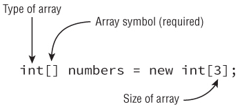
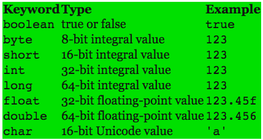
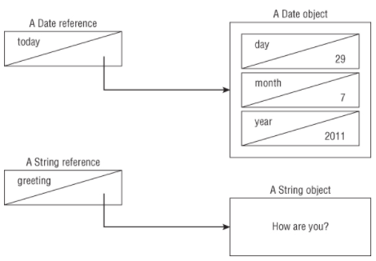
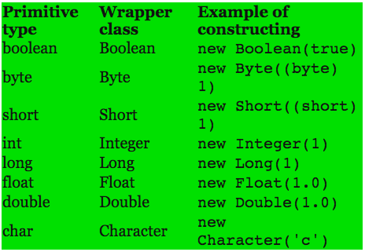

<!--
$theme: default
page_number: true
footer: Java Class - Module 5
-->
# Module 5: Ammon Gruwell, Andrew Jensen

- Arrays
- Strings
- References vs. Primitives
- Equality
- Wrapper Classes
- Varargs
-----------------------------------------------------------------------------
# Arrays

- An Array is an ordered list of items that are all of the same type
  - {15, 31, 7}
  - {'a', 'g', 'x'}
- The items in the list are numbered starting at 0


- Arrays initialize to 0
- Arrays may contain duplicates
-----------------------------------------------------------------------------
# Creating An Array
```
int[] numbers = new int[3];
```
- Creates new array with three elements named "numbers"
- Each element is initialized to 0
- What type is the variable "numbers"?



-----------------------------------------------------------------------------
# Creating An Initialized Array

```
int[] myNumbers = new int[] {42, 55, 99};
int[] numbers2 = {42, 55, 99};
```
- When initializing, we can leave off the "new int[]" part


-----------------------------------------------------------------------------
# Creating An Array: Syntax

- Which of these is valid Java syntax?
```
int[] myArray1;
int [] myArray2;
int myArray3[];
int myArray4 [];
```

-----------------------------------------------------------------------------
# Creating An Array of Objects

```
String[] bugs = {"cricket", "beetle", "ladybug"};
```
- Array only contains references to the objects, not the objects themselves


- In the following example, what does each item in the list initialize to?
```
String[] foods = new String[5];
```
-----------------------------------------------------------------------------
# Using Arrays
- To access an item in an array we use the "varName[index]" notation
- We can get the size of an array using the "length" attribute
```
String[] animals = {"tiger", "kangaroo", "shark"};
System.out.println(animals[0]); // tiger
System.out.println(animals[2]); // shark
System.out.println(animals.length); // 3
```
-----------------------------------------------------------------------------
# Practice!
- Open up Favorites.java
-----------------------------------------------------------------------------
# Multidimensional Arrays
- Arrays can have more than one dimension
- String[][] rectangle = new String[3][2];


-----------------------------------------------------------------------------
# Practice!
- Open up TwoDimArray.java
-----------------------------------------------------------------------------
# Strings
- A sequence of characters
- String myName = "Ammon";
  - Is this a primitive type?
  - If not, why no "new" keyword?

-----------------------------------------------------------------------------
# String Concatenation
- To combine two strings we use the + operator
- When strings are concatenated with numbers, the numbers are converted to strings
```
- System.out.print("abc" + "de"); //abcde
- System.out.print(99 + " red balloons"); //99 red balloons
- System.out.print(9 + 9 + " red balloons"); //18 red balloons
```

-----------------------------------------------------------------------------
# String Concatenation Rules
- Rules to follow when concatenating:
  - When "adding" two numbers use numeric addition
  - Use string concatenation otherwise
  - Go left to right
```
int three = 3;
String four = "4";
System.out.println(1 + 2 + three + four);
```

-----------------------------------------------------------------------------
# String Immutability
- Mutable = changeable
- An immutable object is one that can't be changed once it is created
- Strings are immutable

-----------------------------------------------------------------------------
# String Immutability
- What does the following code print out?
```
String s1 = '1';
String s2 = s1.concat("2");
s2.concat("3");
System.out.println(s2);
```

-----------------------------------------------------------------------------
# String Comparison

```
String a = "12345";
String b = "12345";

//How will the following variables be set?
boolean ref_equality = (a == b) ? true : false;
boolean val_equality = (a.equals(b)) ? true : false;
```

-----------------------------------------------------------------------------
# The String Pool
- In order to save memory, Java reuses string literals
```
String a = "Error";
String b = "Error";
```
- In this code the variables a and b will both point to a single copy of "Error" in the Java String Pool


-----------------------------------------------------------------------------
# String Methods
- length() - returns the length of a string
  - Don't confuse with the ".length" attribute of arrays
```
String axiom = "Java Rocks!";
System.out.print(axiom.length()); //11
```
- charAt(int index) - returns the character at the specified index
```
System.out.print(axiom.charAt(5)); //R
System.out.print(axiom.charAt(15)); //Error!
```
-----------------------------------------------------------------------------
# String Methods
- indexOf(char c) - returns the index of a given character or string
  - indexOf(String s) 
```
String truth = "I love Java!";
System.out.print(truth.indexOf('v')); //4
System.out.print(truth.indexOf("Java")); //7
System.out.print(truth.indexOf("C++"); //-1
```
- substring(int start, int end) - returns part of a string
  - substring(int start)
```
System.out.print(truth.substring(7, 11) + " loves me"); 
//Java loves me
```
-----------------------------------------------------------------------------
# String Methods
- toLowerCase() - converts all letters in the string to lower case
  - toUpperCase()
```
String lie = "Java is Hard";
System.out.print(lie.toLowerCase()); //java is hard
System.out.print(lie.toUpperCase()); //JAVA IS HARD
```
- equals(String s) - checks value equality
  - equalsIgnoreCase(String s)
```
System.out.print(lie.equals("java is hard")); //false
System.out.print(lie.equalsIgnoreCase("java is hard")); //true
``` 
-----------------------------------------------------------------------------
# String Methods
- startsWith(String prefix) - indicates if the string starts with the given prefix
- endsWith(String suffix) - indicates if the string ends with the given suffix
- contains(String s) - indicates if the string contains the given substring
- replace(char c, char d) - replaces one char in the string with another
  - replace(String s, String t)
- trim() - trims off all whitespace before and after the string
-----------------------------------------------------------------------------
# String Method Chaining
- What does the following print out?
```
String result = " My Programs Never Have Bugs ".trim()
                 .toLowerCase().substring(3)
                 .replace("never", "always");
System.out.println(result);
```
-----------------------------------------------------------------------------
# Practice
- Open up Strings.java!

-----------------------------------------------------------------------------
# Primitives
- Primitives are the basic building blocks of everything in Java
- A primitive value is held directly in memory
- It cannot be null
- It cannot have any methods



-----------------------------------------------------------------------------
# Reference Types
- A reference type holds the memory address of a Java object
- It can be set to null and can have methods



-----------------------------------------------------------------------------
# Value Equality vs. Identity Equality
- When comparing numbers we use the == operator
- When comparing objects the == operator compares references and not the actual objects themselves.
- To compare the actual objects we override and use the equals() method
-----------------------------------------------------------------------------
# Example!
- Open up Duck.java
-----------------------------------------------------------------------------
# Wrapper Classes
- Frequently, Java data structures only accept objects
- If we want to store primitives in these containers then we have to wrap them in an object first
- Java has wrapper classes that correspond to each primitive type



-----------------------------------------------------------------------------
# Varargs
- Varargs is short for variable arguments
- It is a method paramater that can accept any number of items
- It can be treated much like an array by the called method
- A method may only have one varargs parameter and it must be last
```
public static void printNumbers(int... numbers){ //
  for(int i=0; i<numbers.length; i++){
    System.out.print(numbers[i] + " ");
  }
}
public static void main(String[] args){
  printNumbers(1); //1
  printNumbers(5, 3, 8); //5 3 8
}
```
-----------------------------------------------------------------------------
# References :
- OCA Java SE 8 Programmer I Study Guide
- https://docs.oracle.com/javase/tutorial/java/nutsandbolts/arrays.html
- https://docs.oracle.com/javase/tutorial/java/data/strings.html
- Feel free to contact me with questions : @gruwella / gruwella@gmail.com

-----------------------------------------------------------------------------
# That's All For Today!