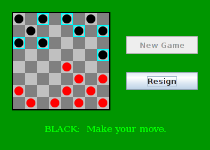

# Documentation

We just talked about using Java code written by others.

- What do we import?
- What methods do we call?
- What do those methods do?

---

# What to Import

I want to import `SoundbankReader`. Write the import statement.


---

# What to Import: Answer

I want to import `SoundbankReader`. Write the import statement.


```java
import javax.sound.midi.spi.SoundbankReader;
```

---

# Integer Class

What is this class good for?


---

# Public Fields

How would you print out the largest possible Integer?


(Reminder: These are static fields.)
(By default this class is already imported being in `java.lang`.)

---

# Public Fields

How would you print out the largest possible Integer?


```java
System.out.println(Integer.MAX_VALUE);
```

---

# Constructors

How is each constructor called?


---

# Constructors

How is each constructor called?


```java
Integer intNum = new Integer(3);
Integer intStr = new Integer("12");
Integer fail = new Integer("fail"); // What will happen?
```

---

# Methods

How would you get the float value from an `Integer` (without casting)?


---

# Methods

How would you get the float value from an `Integer` (without casting)?


```java
Integer intObj = new Integer(45);
float f = intObj.floatValue();
```

---

# Methods

How is `parseInt` called? What type is returned?


---

# Methods

How is `parseInt` called? What type is returned?


```java
int i = Integer.parseInt("3");
```

---

# Creating Javadoc Documentation

Next I will show you how to generate documentation that looks just like Java's documentation.

---

# Class Description

```java
/**
 * This is an example class.
 * @author Me
 */
public class Example {
```
Notes:
- Precedes the class.
- Always starts with `/**` and ends with `*/`.
- There are a number of useful tags. I will only show the most common ones.

---

# Field Description

```java
	/** Mighty fine constant */
	public static final String CONST = "Unchanging";
```
Javadoc comments can just be a single line.
Often they are when it is a field.

---

# Constructor/Method Description

```java
	/**
	 * Real constructor
	 * @param parameter Give the example an int
	 */
	public Example(int parameter) {
```
- Starts with general description of the method/constructor.
- Use the `@param` annotation to mark descriptions of each parameter.
- Form: `@param [name] comment`

---

# Method Description with Return

```java
	/**
	 * Useful method
	 * @param speed in knots
	 * @return fun factor as an integer
	 */
	public int fly(int speed) {
```
- The `@return` annotation allows for specific comments about what is returned.


---

# Javadoc Command

```bash
> javadoc Example.java
```
- You can run javadoc on a specific file(s) or a list of packages.
- Will auto-generate all of the HTML and formatting.
- Mimics Oracle's Java API.

---

# Javadoc Command

```bash
> javadoc Example.java
Loading source file Example.java...
Constructing Javadoc information...
Standard Doclet version 1.8.0_144
Building tree for all the packages and classes...
Generating ./Example.html...
Generating ./package-frame.html...
Generating ./package-summary.html...
Generating ./package-tree.html...
Generating ./constant-values.html...
Building index for all the packages and classes...
Generating ./overview-tree.html...
Generating ./index-all.html...
Generating ./deprecated-list.html...
Building index for all classes...
Generating ./allclasses-frame.html...
Generating ./allclasses-noframe.html...
Generating ./index.html...
Generating ./help-doc.html...
```

---

# Google It!

There is more information than just documentation from Oracle:
- Example code
- Additional explanations
- Tutorials
- Libraries

---

# Consider the possibilites of programming

Visual Game.


Artificial Intelligence.


